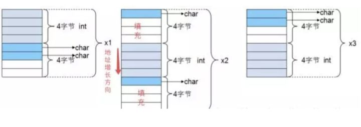

# C++内存管理

## 1.讲一下C++内存分布？

参考： 
- [Harlon's Blog: C/C++内存布局策略详解](http://harlon.org/2018/04/21/cpluscplusmemory/)

- [Linux虚拟地址空间布局](https://www.cnblogs.com/clover-toeic/p/3754433.html)

C 中的内存布局： 

一个C++程序可以分为（自上往下）:
- **栈**
- **堆**：堆又分为new分配的存储区和malloc分配的内存块，new分配的存储区会在程序结束之后，系统会帮助我们清理；
- **全局/静态存储区**：在C++中，不再区分数据段和BSS段，未初始化和初始化的全局/静态变量都会存储在这里，并且初始化为0；
- **常量存储区**
- **代码段**

## 2.栈内存和堆内存的区别，优缺点？
堆：
> 堆是动态内存分配区，向高地址增长，堆中分配内存和释放内存需要调用malloc/new或free/delete。

栈：
> 栈和堆一般相邻，但沿着相反方向增长。当栈指针和堆指针相等就说明堆栈内存耗尽。栈中保存的是局部变量和每次函数调用时的信息。每次函数调用返回地址，一些调用者环境信息（比如寄存器）都被存放在栈中。然后新调用的函数就会在栈中为他们的自动或者临时变量分配内存空间，这就是C中递归函数调用的过程。每次递归函数调用自己，新的堆栈就会被创建，这样新的变量集合就不会被其他函数实例的变量集合影响了。

## 3.堆内存：malloc和new，free和delete？
- `malloc`和`free`是标准库函数，支持覆盖；`new`和`delete`是运算符，并且支持重载；
- `malloc`仅仅分配内存空间，`free`仅仅回收内存空间，不具备调用构造函数和析构函数的功能，用`malloc`函数分配存储类的对象存在风险；`new`的`delete`除了分配回收功能外，还能调用构造函数和析构函数。
- `malloc`返回的是`void`类型的指针，必须进行类型转换，而`new`和`delete`返回的是具体类型指针。

## 4.C/C++ struct内存对齐策略？
参考：
- [C/C++内存对齐策略](http://harlon.org/2018/04/05/cpluscplusmemorypack/)
- [知乎：C/C++内存对齐详解](https://zhuanlan.zhihu.com/p/30007037)

1. What：什么是内存对齐？

    先看一下以下这个程序，理论上，32位系统下，int占4byte，char占一个byte，那么将它们放到一个结构体中应该占4+1=5byte；但是实际上，通过运行程序得到的结果是8 byte，这就是内存对齐所导致的。

    ```C
    //32位系统
    #include<stdio.h>
    struct{
        int x;
        char y;
    }s;

    int main()
    {
        printf("%d\n",sizeof(s);  // 输出8
        return 0;
    }
    ```

    现代计算机中内存空间都是按照 byte 划分的，从理论上讲似乎对任何类型的变量的访问可以从任何地址开始，但是实际的计算机系统对基本类型数据在内存中存放的位置有限制，它们会要求这些数据的首地址的值是某个数k（通常它为4或8）的倍数，这就是所谓的**内存对齐**。

2. Why：为什么要进行内存对齐？

    CPU在读取内存的时候并不是一个字节一个字节读的，而是按照一个叫做**内存存取粒度**的参数来读取的。处理器一般会以4字节，8字节（一个字）这样为单位来存取内存。

    假如没有内存对齐机制，数据可以任意存放，现在一个int变量存放在从地址1开始的连续四个字节地址中，该处理器去取数据时，要先从0地址开始读取第一个4字节块,剔除不想要的字节（0地址）,然后从地址4开始读取下一个4字节块,同样剔除不要的数据（5，6，7地址）,最后留下的两块数据合并放入寄存器。这需要做很多工作。

    

    现在有了内存对齐的，int类型数据只能存放在按照对齐规则的内存中，比如说0地址开始的内存。那么现在该处理器在取数据时一次性就能将数据读出来了，而且不需要做额外的操作，提高了效率。

    

3. How：如何实现内存对齐？

    方案：由对齐系数（对齐模数）和结构体中最长数据类型长度确定**有效对齐值**，再由**规则**和有效对齐值配合产生方案。

    gcc中默认#pragma pack(4)，可以通过预编译命令#pragma pack(n)，n = 1,2,4,8,16来改变这一系数。

    内存对齐需要遵循的规则：

    1. 对齐各个成员。结构体第一个成员的**偏移量（offset）**为0，以后每个成员相对于结构体首地址 offset都是**该成员大小与有效对齐值中较小那个**的整数倍，如有需要编译器会在成员之间加上填充字节。

    2. 对齐整个结构体。结构体的总大小为**有效对齐值**的整数倍，如有需要编译器会在最末一个成员之后加上填充字节。

4. Example

    ```C
    //32位系统
    #include<stdio.h>
    struct
    {
        int i;    
        char c1;  
        char c2;  
    }x1;

    struct{
        char c1;  
        int i;    
        char c2;  
    }x2;

    struct{
        char c1;  
        char c2; 
        int i;    
    }x3;

    int main()
        {
        printf("%d\n",sizeof(x1));  // 输出8
        printf("%d\n",sizeof(x2));  // 输出12
        printf("%d\n",sizeof(x3));  // 输出8
        return 0;
    }   
    ```

    

5. Is it neccessary?

    在网络编程中内存对齐是一个非常重要的策略，因为你希望尽可能地将发送数据压缩。
