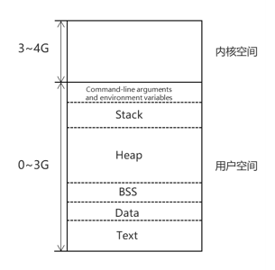

# C++内存管理

## 1.讲一下C++内存分布？

参考： [Harlon's Blog: C/C++内存布局策略详解](http://harlon.org/2018/04/21/cpluscplusmemory/)

C 中的内存布局： 

一个C++程序可以分为（自上往下）:
- **栈**
- **堆**：堆又分为new分配的存储区和malloc分配的内存块，new分配的存储区会在程序结束之后，系统会帮助我们清理；
- **全局/静态存储区**：在C++中，不再区分数据段和BSS段，未初始化和初始化的全局/静态变量都会存储在这里，并且初始化为0；
- **常量存储区**
- **代码段**

## 2.栈内存和堆内存的区别，优缺点？
堆：
> 堆是动态内存分配区，向高地址增长，堆中分配内存和释放内存需要调用malloc/new或free/delete。

栈：
> 栈和堆一般相邻，但沿着相反方向增长。当栈指针和堆指针相等就说明堆栈内存耗尽。栈中保存的是局部变量和每次函数调用时的信息。每次函数调用返回地址，一些调用者环境信息（比如寄存器）都被存放在栈中。然后新调用的函数就会在栈中为他们的自动或者临时变量分配内存空间，这就是C中递归函数调用的过程。每次递归函数调用自己，新的堆栈就会被创建，这样新的变量集合就不会被其他函数实例的变量集合影响了。

## 3.堆内存：malloc和new，free和delete？
- `malloc`和`free`是标准库函数，支持覆盖；`new`和`delete`是运算符，并且支持重载；
- `malloc`仅仅分配内存空间，`free`仅仅回收内存空间，不具备调用构造函数和析构函数的功能，用`malloc`函数分配存储类的对象存在风险；`new`的`delete`除了分配回收功能外，还能调用构造函数和析构函数。
- `malloc`返回的是`void`类型的指针，必须进行类型转换，而`new`和`delete`返回的是具体类型指针。

## 4.C/C++ struct内存对齐策略？
参考：
- [C/C++内存对齐策略](http://harlon.org/2018/04/05/cpluscplusmemorypack/)
- [C/C++内存对齐详解](https://zhuanlan.zhihu.com/p/30007037)
